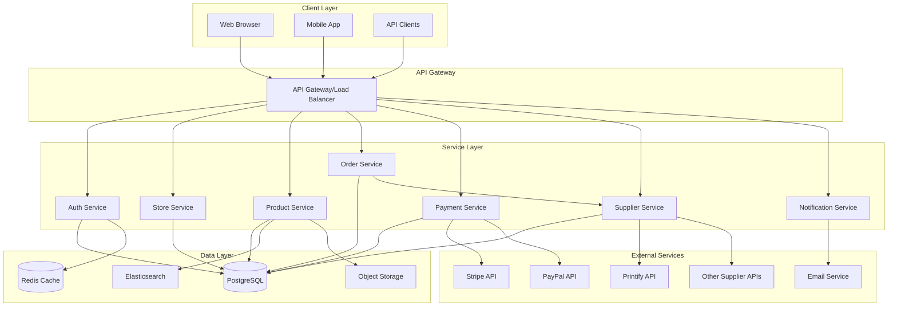
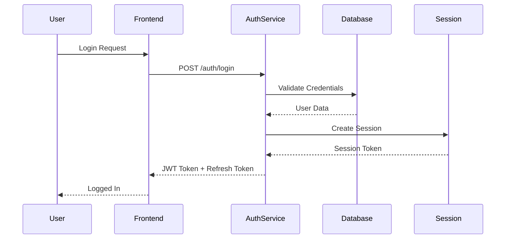
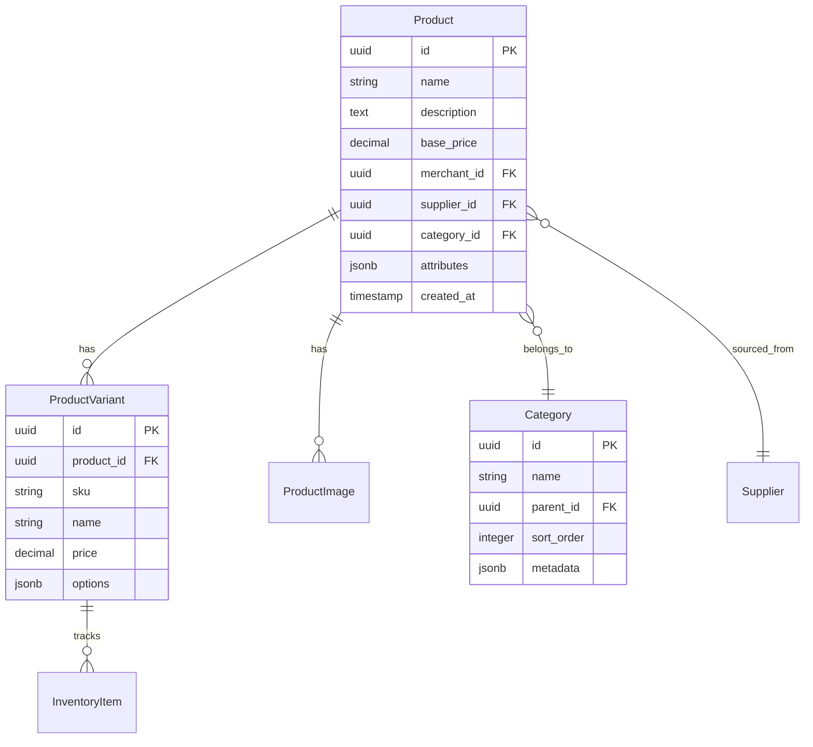
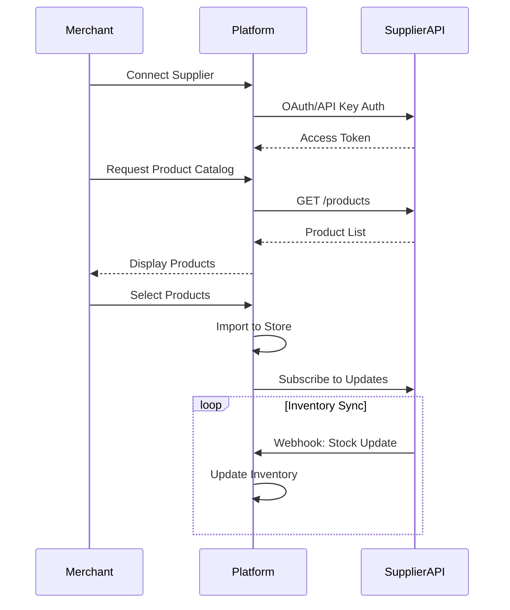
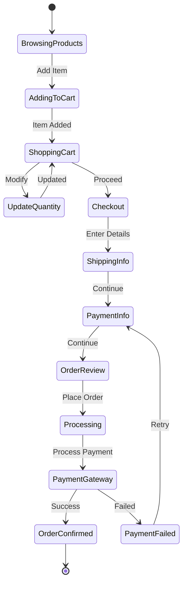
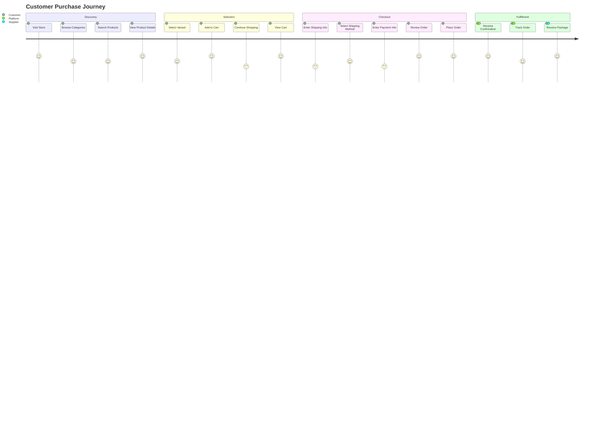
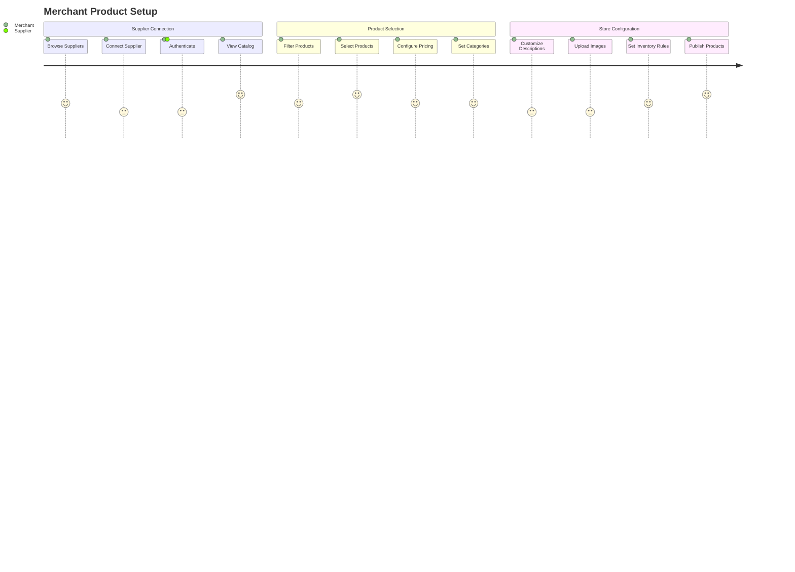

# Modern eCommerce Platform Specification

## Executive Summary

A modular, Rust-based eCommerce platform designed to be a modern alternative to Shopify, featuring dropshipping capabilities, multi-tenant architecture, and seamless API integrations. The platform supports three distinct user types: Customers, Merchants, and Suppliers, with a focus on flexibility and modern development practices.

## Table of Contents

1. [System Overview](#system-overview)
2. [Architecture](#architecture)
3. [User Roles & Permissions](#user-roles--permissions)
4. [Core Modules](#core-modules)
5. [Data Models](#data-models)
6. [API Specifications](#api-specifications)
7. [User Flows](#user-flows)
8. [Technical Requirements](#technical-requirements)
9. [Security Considerations](#security-considerations)
10. [Development Phases](#development-phases)

## System Overview

### Vision
Build a next-generation eCommerce platform that provides merchants with powerful tools to manage dropshipping operations while offering customers a seamless shopping experience.

### Key Features
- Multi-tenant architecture supporting multiple stores
- Dropshipping integration with multiple suppliers
- Flexible product categorization system
- Real-time inventory management
- Integrated payment processing
- Order fulfillment automation
- Responsive storefront customization

### Technology Stack
- **Backend**: Rust (Actix-web or Axum framework)
- **Database**: PostgreSQL with Redis caching
- **Frontend**: React/Next.js or SolidJS
- **Payment**: Stripe, PayPal integrations
- **Message Queue**: RabbitMQ or Kafka for async operations
- **Search**: Elasticsearch for product search
- **CDN**: CloudFlare for static assets

## Architecture

### High-Level Architecture



### Microservices Architecture

Each service is independently deployable and scalable:

1. **Auth Service**: User authentication, authorization, session management
2. **Store Service**: Store configuration, themes, settings
3. **Product Service**: Product catalog, categories, inventory
4. **Order Service**: Cart management, order processing, fulfillment
5. **Payment Service**: Payment processing, refunds, transactions
6. **Supplier Service**: Supplier integration, product sourcing, dropshipping
7. **Notification Service**: Email, SMS, push notifications

## User Roles & Permissions

### Customer
- Browse products and categories
- Manage shopping cart
- Place and track orders
- Manage personal profile and addresses
- View order history
- Write product reviews
- Manage payment methods

### Merchant
- Manage store settings and branding
- Configure product categories
- Select and manage suppliers
- Curate product catalog
- View sales analytics and reports
- Manage customer service
- Configure payment methods
- Set pricing and discounts
- Manage inventory rules

### Supplier
- Manage product catalog
- Update inventory levels
- Process dropship orders
- Provide tracking information
- Manage pricing and availability
- API access management
- View order statistics

## Core Modules

### 1. Authentication & Authorization Module



**Features:**
- JWT-based authentication
- OAuth2 social login
- Role-based access control (RBAC)
- Multi-factor authentication (MFA)
- Password reset functionality
- Session management

### 2. Store Management Module

**Features:**
- Store creation and configuration
- Theme customization
- Domain management
- SEO settings
- Analytics dashboard
- Multi-language support
- Currency configuration

### 3. Product Management Module



**Features:**
- Product CRUD operations
- Variant management (size, color, etc.)
- Category hierarchy
- Bulk import/export
- Image management
- SEO optimization
- Product search and filtering

### 4. Supplier Integration Module

**Features:**
- Supplier API integration framework
- Product synchronization
- Inventory updates
- Order forwarding
- Tracking synchronization
- Price updates
- Supplier performance metrics

**Integration Flow:**



### 5. Shopping Cart & Checkout Module



**Features:**
- Persistent cart across sessions
- Guest checkout
- Multiple shipping addresses
- Shipping calculator
- Tax calculation
- Coupon/discount codes
- Order summary

### 6. Payment Processing Module

**Features:**
- Multiple payment gateway support
- PCI compliance
- Tokenization
- Recurring payments
- Refund processing
- Payment method vault
- Transaction history

### 7. Order Management Module

**Features:**
- Order lifecycle management
- Automated fulfillment
- Tracking integration
- Return/refund processing
- Order status notifications
- Bulk order processing
- Invoice generation

## Data Models

### Core Entities

```rust
// User Entity
pub struct User {
    pub id: Uuid,
    pub email: String,
    pub username: String,
    pub password_hash: String,
    pub role: UserRole,
    pub profile: UserProfile,
    pub created_at: DateTime<Utc>,
    pub updated_at: DateTime<Utc>,
}

pub enum UserRole {
    Customer,
    Merchant,
    Supplier,
    Admin,
}

// Store Entity
pub struct Store {
    pub id: Uuid,
    pub merchant_id: Uuid,
    pub name: String,
    pub domain: String,
    pub settings: StoreSettings,
    pub theme: Theme,
    pub created_at: DateTime<Utc>,
}

// Product Entity
pub struct Product {
    pub id: Uuid,
    pub store_id: Uuid,
    pub supplier_id: Option<Uuid>,
    pub name: String,
    pub description: String,
    pub category_id: Uuid,
    pub base_price: Decimal,
    pub variants: Vec<ProductVariant>,
    pub images: Vec<ProductImage>,
    pub metadata: serde_json::Value,
}

// Order Entity
pub struct Order {
    pub id: Uuid,
    pub order_number: String,
    pub customer_id: Uuid,
    pub store_id: Uuid,
    pub items: Vec<OrderItem>,
    pub shipping_address: Address,
    pub billing_address: Address,
    pub payment: PaymentInfo,
    pub status: OrderStatus,
    pub total: Decimal,
    pub created_at: DateTime<Utc>,
}

pub enum OrderStatus {
    Pending,
    Processing,
    Paid,
    Shipped,
    Delivered,
    Cancelled,
    Refunded,
}
```

## API Specifications

### RESTful API Structure

```yaml
# Base URL: https://api.platform.com/v1

# Authentication Endpoints
POST   /auth/register
POST   /auth/login
POST   /auth/logout
POST   /auth/refresh
POST   /auth/forgot-password
POST   /auth/reset-password

# Store Management (Merchant)
GET    /stores
POST   /stores
GET    /stores/{store_id}
PUT    /stores/{store_id}
DELETE /stores/{store_id}
PUT    /stores/{store_id}/settings
PUT    /stores/{store_id}/theme

# Product Management
GET    /stores/{store_id}/products
POST   /stores/{store_id}/products
GET    /products/{product_id}
PUT    /products/{product_id}
DELETE /products/{product_id}
POST   /products/{product_id}/variants
PUT    /products/{product_id}/images

# Categories
GET    /stores/{store_id}/categories
POST   /stores/{store_id}/categories
PUT    /categories/{category_id}
DELETE /categories/{category_id}

# Supplier Integration
GET    /suppliers
POST   /suppliers/connect
GET    /suppliers/{supplier_id}/products
POST   /suppliers/{supplier_id}/import
POST   /suppliers/{supplier_id}/sync

# Shopping Cart
GET    /cart
POST   /cart/items
PUT    /cart/items/{item_id}
DELETE /cart/items/{item_id}
POST   /cart/clear

# Checkout & Orders
POST   /checkout/calculate
POST   /checkout/process
GET    /orders
GET    /orders/{order_id}
POST   /orders/{order_id}/cancel
POST   /orders/{order_id}/refund

# Customer Account
GET    /account/profile
PUT    /account/profile
GET    /account/addresses
POST   /account/addresses
PUT    /account/addresses/{address_id}
DELETE /account/addresses/{address_id}
GET    /account/payment-methods
POST   /account/payment-methods
DELETE /account/payment-methods/{method_id}

# Webhooks (for suppliers and payment providers)
POST   /webhooks/supplier/{supplier_id}
POST   /webhooks/payment/{provider}
```

### GraphQL Alternative

```graphql
type Query {
  # Store queries
  store(id: ID!): Store
  stores(merchantId: ID!): [Store!]!
  
  # Product queries
  product(id: ID!): Product
  products(
    storeId: ID!
    category: ID
    search: String
    limit: Int
    offset: Int
  ): ProductConnection!
  
  # Order queries
  order(id: ID!): Order
  orders(customerId: ID!): [Order!]!
  
  # Cart queries
  cart: Cart
}

type Mutation {
  # Authentication
  login(email: String!, password: String!): AuthPayload!
  register(input: RegisterInput!): AuthPayload!
  
  # Product management
  createProduct(input: ProductInput!): Product!
  updateProduct(id: ID!, input: ProductInput!): Product!
  
  # Cart operations
  addToCart(productId: ID!, variantId: ID, quantity: Int!): Cart!
  updateCartItem(itemId: ID!, quantity: Int!): Cart!
  removeFromCart(itemId: ID!): Cart!
  
  # Order processing
  checkout(input: CheckoutInput!): Order!
  cancelOrder(id: ID!): Order!
}

type Subscription {
  orderStatusChanged(orderId: ID!): Order!
  inventoryUpdated(productId: ID!): Product!
}
```

## User Flows

### Customer Purchase Flow



### Merchant Product Setup Flow



## Technical Requirements

### Performance Requirements
- Page load time: < 2 seconds
- API response time: < 200ms for 95th percentile
- Database query time: < 50ms for 95th percentile
- Support 10,000 concurrent users per store
- 99.9% uptime SLA

### Scalability Requirements
- Horizontal scaling for all services
- Auto-scaling based on load
- Database sharding by store_id
- CDN for static assets
- Caching strategy for frequently accessed data

### Security Requirements
- TLS 1.3 for all communications
- PCI DSS compliance for payment processing
- GDPR compliance for data protection
- Rate limiting and DDoS protection
- Regular security audits
- Encryption at rest for sensitive data
- OWASP Top 10 compliance

### Integration Requirements
- RESTful API with OpenAPI documentation
- GraphQL API option
- Webhook support for real-time updates
- SDK support for popular languages
- Batch processing capabilities
- Event-driven architecture

## Security Considerations

### Data Protection
- Encryption of sensitive data (PII, payment info)
- Secure token storage
- SQL injection prevention
- XSS protection
- CSRF protection
- Input validation and sanitization

### Authentication & Authorization
- Multi-factor authentication
- OAuth2/OpenID Connect support
- Role-based access control
- API key management
- Session timeout policies
- Password complexity requirements

### Compliance
- PCI DSS Level 1 compliance
- GDPR/CCPA compliance
- SOC 2 Type II certification
- Regular penetration testing
- Security incident response plan

## Development Phases

### Phase 1: Foundation (Months 1-3)
- [ ] Core authentication system
- [ ] Basic user management
- [ ] Database schema design
- [ ] API gateway setup
- [ ] Basic store creation

### Phase 2: Product Management (Months 3-5)
- [ ] Product CRUD operations
- [ ] Category management
- [ ] Image handling
- [ ] Search functionality
- [ ] Basic inventory tracking

### Phase 3: Supplier Integration (Months 5-7)
- [ ] Supplier API framework
- [ ] Printify integration
- [ ] Product synchronization
- [ ] Inventory updates
- [ ] Order forwarding

### Phase 4: Shopping & Checkout (Months 7-9)
- [ ] Shopping cart
- [ ] Checkout flow
- [ ] Stripe integration
- [ ] PayPal integration
- [ ] Order processing

### Phase 5: Advanced Features (Months 9-11)
- [ ] Analytics dashboard
- [ ] Email notifications
- [ ] Customer reviews
- [ ] Discount system
- [ ] Multi-language support

### Phase 6: Optimization & Launch (Months 11-12)
- [ ] Performance optimization
- [ ] Security hardening
- [ ] Load testing
- [ ] Documentation
- [ ] Beta testing
- [ ] Production deployment

## Monitoring & Analytics

### Key Metrics
- **Business Metrics**
  - Gross Merchandise Volume (GMV)
  - Average Order Value (AOV)
  - Conversion Rate
  - Cart Abandonment Rate
  - Customer Lifetime Value (CLV)

- **Technical Metrics**
  - API latency
  - Error rates
  - Database performance
  - Cache hit rates
  - Service availability

- **User Metrics**
  - Daily Active Users (DAU)
  - Monthly Active Users (MAU)
  - Session duration
  - Page views per session
  - User retention rate

### Monitoring Stack
- Application Performance Monitoring (APM)
- Log aggregation (ELK stack)
- Metrics collection (Prometheus/Grafana)
- Error tracking (Sentry)
- Uptime monitoring
- Real User Monitoring (RUM)

## Testing Strategy

### Testing Levels
1. **Unit Tests**: 80% code coverage minimum
2. **Integration Tests**: API endpoint testing
3. **End-to-End Tests**: Critical user flows
4. **Performance Tests**: Load and stress testing
5. **Security Tests**: Vulnerability scanning

### Testing Tools
- Unit: Rust built-in testing framework
- Integration: Postman/Newman
- E2E: Cypress or Playwright
- Performance: K6 or JMeter
- Security: OWASP ZAP

## Documentation Requirements

### Technical Documentation
- API documentation (OpenAPI/Swagger)
- Database schema documentation
- Architecture decision records (ADRs)
- Deployment guides
- Troubleshooting guides

### User Documentation
- Merchant onboarding guide
- Supplier integration guide
- Customer help center
- Video tutorials
- API developer documentation

## Success Criteria

### Launch Criteria
- All Phase 1-4 features completed
- Security audit passed
- Performance benchmarks met
- 95% test coverage
- Documentation complete
- Beta testing feedback incorporated

### Post-Launch Metrics
- 1,000 active merchants in first 6 months
- 100,000 transactions in first year
- < 0.1% transaction failure rate
- 4.5+ star merchant satisfaction rating
- < 24 hour support response time

## Conclusion

This specification outlines a comprehensive, modern eCommerce platform built with Rust that addresses the limitations of current solutions while providing a flexible, scalable foundation for growth. The modular architecture ensures that components can be developed, tested, and deployed independently, while the focus on supplier integration and dropshipping capabilities provides merchants with powerful tools to manage their businesses effectively.

The platform's emphasis on performance, security, and user experience positions it as a next-generation solution ready to compete with established players while offering unique advantages through modern technology choices and architectural decisions.