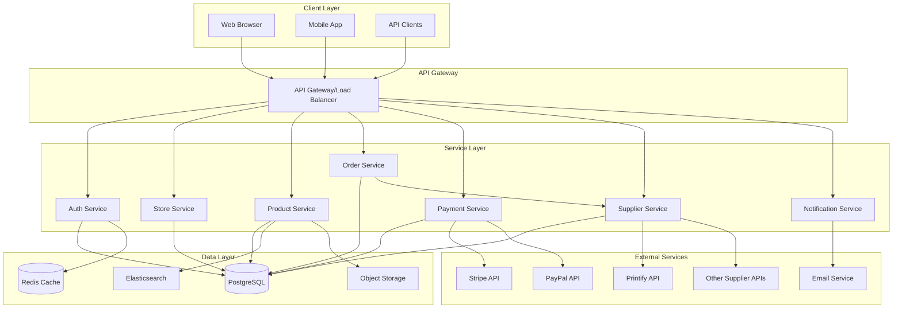

# Architecture Specification

## High-Level Architecture

## Microservices Architecture

Each service is independently deployable and scalable:

1. **Auth Service**: User authentication, authorization, session management
2. **Store Service**: Store configuration, themes, settings
3. **Product Service**: Product catalog, categories, inventory
4. **Order Service**: Cart management, order processing, fulfillment
5. **Payment Service**: Payment processing, refunds, transactions
6. **Supplier Service**: Supplier integration, product sourcing, dropshipping
7. **Notification Service**: Email, SMS, push notifications

## Technology Stack

- **Backend**: Rust (Actix-web or Axum framework)
- **Database**: PostgreSQL with Redis caching
- **Frontend**: React/Next.js or SolidJS
- **Payment**: Stripe, PayPal integrations
- **Message Queue**: RabbitMQ or Kafka for async operations
- **Search**: Elasticsearch for product search
- **CDN**: CloudFlare for static assets

## Implementation Notes

- Each microservice should be containerized using Docker
- Service-to-service communication via REST APIs or gRPC
- Event-driven architecture for async operations
- Database per service pattern for data isolation
- Shared libraries for common utilities and models