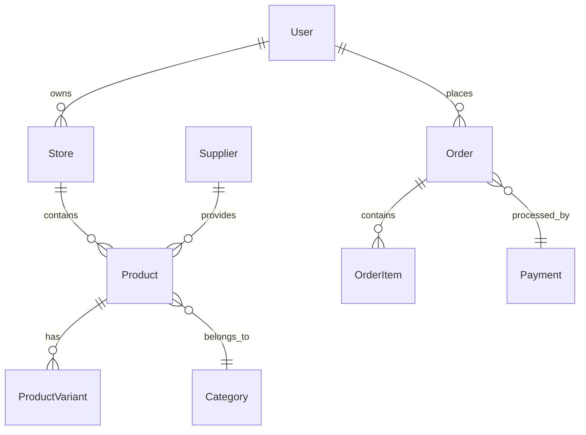

# Data Models Specification

## Overview
This directory contains the complete data model specifications for the eCommerce platform, organized by domain.

## Structure
- `core.md` - Core entities (User, Store, etc.)
- `products.md` - Product-related models
- `orders.md` - Order and transaction models
- `suppliers.md` - Supplier integration models
- `payments.md` - Payment and financial models

## Design Principles

### Database Design
- Use UUIDs for all primary keys
- Implement soft deletes where appropriate
- Add created_at/updated_at timestamps
- Use JSONB for flexible attributes
- Foreign key constraints for data integrity

### Rust Implementation
- Derive traits for serialization (serde)
- Use appropriate Rust types (BigDecimal for currency)
- Implement proper error handling
- Use enums for status fields
- Add validation attributes

### Performance Considerations
- Index frequently queried fields
- Partition large tables by date/tenant
- Use materialized views for analytics
- Implement proper caching strategies
- Consider read replicas for scaling

## Relationships Overview

## Implementation Guidelines

1. **Start with core models** (User, Store, Product)
2. **Add relationships gradually** 
3. **Implement migrations** for schema changes
4. **Add validation** at both DB and application level
5. **Create test fixtures** for each model
6. **Document API contracts** for each entity