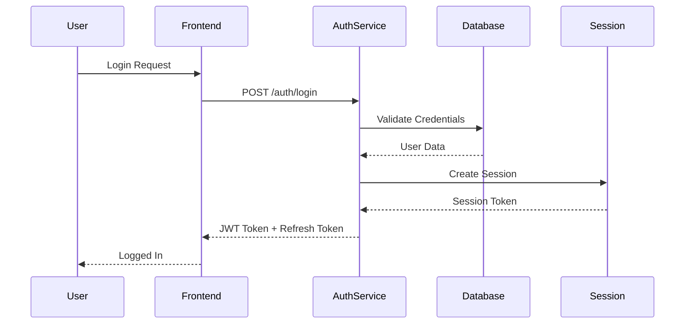

# Authentication & Authorization Module

## Overview
Handles user authentication, authorization, session management, and role-based access control.

## Authentication Flow



## Features

### Core Authentication
- JWT-based authentication
- OAuth2 social login (Google, Facebook, GitHub)
- Password reset functionality
- Email verification
- Session management
- Token refresh mechanism

### Authorization
- Role-based access control (RBAC)
- Permission-based authorization
- Multi-factor authentication (MFA)
- API key management for suppliers
- Rate limiting per user/role

### Security Features
- Password hashing (bcrypt/argon2)
- Brute force protection
- Account lockout policies
- Audit logging
- CSRF protection
- Input validation and sanitization

## API Endpoints

### Authentication
- `POST /auth/register` - User registration
- `POST /auth/login` - User login
- `POST /auth/logout` - User logout
- `POST /auth/refresh` - Refresh JWT token
- `POST /auth/forgot-password` - Password reset request
- `POST /auth/reset-password` - Reset password with token

### Authorization
- `GET /auth/me` - Get current user info
- `PUT /auth/profile` - Update user profile
- `POST /auth/change-password` - Change password
- `GET /auth/permissions` - Get user permissions

## Data Models

```rust
pub struct User {
    pub id: Uuid,
    pub email: String,
    pub password_hash: String,
    pub role: UserRole,
    pub is_verified: bool,
    pub last_login: Option<DateTime<Utc>>,
    pub created_at: DateTime<Utc>,
}

pub enum UserRole {
    Customer,
    Merchant,
    Supplier,
    Admin,
}

pub struct Session {
    pub id: Uuid,
    pub user_id: Uuid,
    pub token: String,
    pub expires_at: DateTime<Utc>,
    pub created_at: DateTime<Utc>,
}
```

## Implementation Priority
1. Basic JWT authentication
2. User registration/login
3. Role-based access control
4. OAuth2 integration
5. MFA implementation
6. Advanced security features