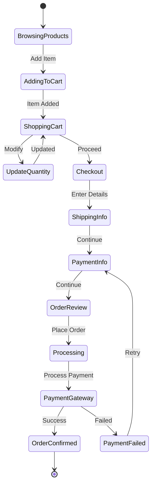

# Shopping Cart & Checkout Module

## Overview
Manages shopping cart functionality, checkout process, and order creation.

## Checkout State Flow



## Features

### Shopping Cart
- Add/remove items to cart
- Update item quantities
- Cart persistence across sessions
- Guest cart support
- Cart abandonment tracking
- Promotional code application
- Tax calculation
- Shipping cost estimation

### Checkout Process
- Multi-step checkout flow
- Guest checkout option
- Address management and validation
- Multiple payment methods
- Order summary and review
- Terms and conditions acceptance
- Email confirmation

### Cart Management
- Save for later functionality
- Recently viewed items
- Cross-sell and upsell suggestions
- Inventory validation
- Price update notifications
- Bulk operations

## API Endpoints

### Cart Operations
- `GET /cart` - Get current cart
- `POST /cart/items` - Add item to cart
- `PUT /cart/items/{id}` - Update cart item
- `DELETE /cart/items/{id}` - Remove item from cart
- `DELETE /cart` - Clear cart
- `POST /cart/coupons` - Apply coupon code

### Checkout Operations
- `POST /checkout/start` - Initialize checkout
- `PUT /checkout/shipping` - Set shipping address
- `PUT /checkout/payment` - Set payment method
- `GET /checkout/summary` - Get order summary
- `POST /checkout/complete` - Complete order

### Guest Cart
- `POST /cart/guest` - Create guest cart
- `POST /cart/guest/convert` - Convert to user cart

## Data Models

```rust
pub struct Cart {
    pub id: Uuid,
    pub user_id: Option<Uuid>,
    pub session_id: Option<String>,
    pub items: Vec<CartItem>,
    pub coupon_code: Option<String>,
    pub subtotal: BigDecimal,
    pub tax_amount: BigDecimal,
    pub shipping_amount: BigDecimal,
    pub total: BigDecimal,
    pub created_at: DateTime<Utc>,
    pub updated_at: DateTime<Utc>,
}

pub struct CartItem {
    pub id: Uuid,
    pub cart_id: Uuid,
    pub product_id: Uuid,
    pub variant_id: Option<Uuid>,
    pub quantity: i32,
    pub unit_price: BigDecimal,
    pub total_price: BigDecimal,
    pub added_at: DateTime<Utc>,
}

pub struct CheckoutSession {
    pub id: Uuid,
    pub cart_id: Uuid,
    pub shipping_address: Option<Address>,
    pub billing_address: Option<Address>,
    pub payment_method: Option<PaymentMethod>,
    pub shipping_method: Option<ShippingMethod>,
    pub status: CheckoutStatus,
    pub expires_at: DateTime<Utc>,
}

pub enum CheckoutStatus {
    Started,
    ShippingSet,
    PaymentSet,
    ReadyForPayment,
    Processing,
    Completed,
    Abandoned,
}

pub struct Address {
    pub first_name: String,
    pub last_name: String,
    pub company: Option<String>,
    pub address_line_1: String,
    pub address_line_2: Option<String>,
    pub city: String,
    pub state: String,
    pub postal_code: String,
    pub country: String,
    pub phone: Option<String>,
}
```

## Business Logic

### Cart Calculations
1. **Subtotal**: Sum of all item prices
2. **Tax**: Calculated based on shipping address
3. **Shipping**: Based on weight, dimensions, and destination
4. **Discounts**: Applied after subtotal calculation
5. **Total**: Subtotal + Tax + Shipping - Discounts

### Validation Rules
- Inventory availability check before checkout
- Minimum order value requirements
- Geographic shipping restrictions
- Payment method validation
- Address format validation

## Implementation Priority
1. Basic cart operations (add/remove/update)
2. Cart persistence and session management
3. Checkout flow implementation
4. Tax and shipping calculations
5. Coupon and discount system
6. Guest checkout functionality
7. Cart abandonment features