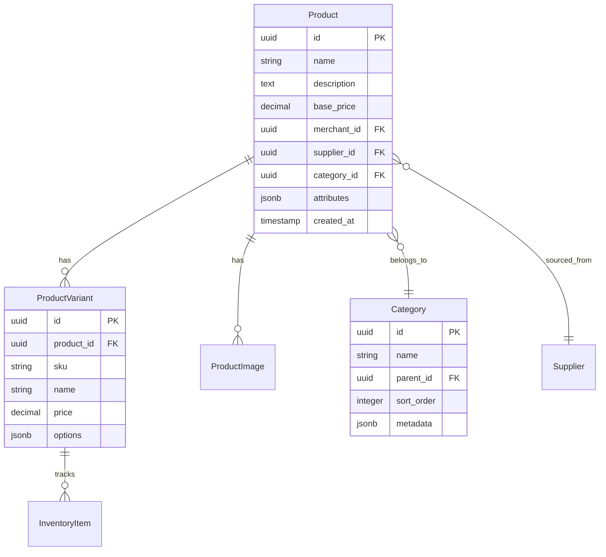

# Product Management Module

## Overview
Manages the product catalog, categories, variants, and inventory tracking.

## Data Model



## Features

### Product Management
- Product CRUD operations
- Variant management (size, color, material, etc.)
- Category hierarchy with unlimited nesting
- Bulk import/export functionality
- Product duplication and templates
- SEO optimization (meta tags, URLs)
- Product status management (draft, active, archived)

### Media Management
- Multiple image uploads per product
- Image optimization and resizing
- Video support for product demos
- CDN integration for fast delivery
- Alt text and accessibility features

### Search & Discovery
- Full-text search across products
- Advanced filtering (price, category, attributes)
- Product recommendations
- Related products
- Recently viewed products
- Elasticsearch integration

### Inventory Integration
- Real-time stock tracking
- Low stock alerts
- Automatic supplier sync
- Inventory reservations during checkout
- Backorder management

## API Endpoints

### Product Operations
- `GET /products` - List products with filtering
- `POST /products` - Create new product
- `GET /products/{id}` - Get product details
- `PUT /products/{id}` - Update product
- `DELETE /products/{id}` - Delete product
- `POST /products/{id}/variants` - Add product variant
- `POST /products/{id}/images` - Upload product images

### Category Operations
- `GET /categories` - List categories
- `POST /categories` - Create category
- `PUT /categories/{id}` - Update category
- `DELETE /categories/{id}` - Delete category

### Search & Discovery
- `GET /search` - Product search
- `GET /products/{id}/related` - Get related products
- `GET /products/recommended` - Get recommendations

## Rust Data Models

```rust
pub struct Product {
    pub id: Uuid,
    pub name: String,
    pub description: Option<String>,
    pub base_price: BigDecimal,
    pub merchant_id: Uuid,
    pub supplier_id: Option<Uuid>,
    pub category_id: Option<Uuid>,
    pub attributes: serde_json::Value,
    pub status: ProductStatus,
    pub created_at: DateTime<Utc>,
    pub updated_at: DateTime<Utc>,
}

pub enum ProductStatus {
    Draft,
    Active,
    Archived,
    OutOfStock,
}

pub struct ProductVariant {
    pub id: Uuid,
    pub product_id: Uuid,
    pub sku: String,
    pub name: String,
    pub price: BigDecimal,
    pub options: serde_json::Value, // {"size": "M", "color": "Red"}
    pub inventory_count: i32,
}

pub struct Category {
    pub id: Uuid,
    pub name: String,
    pub slug: String,
    pub parent_id: Option<Uuid>,
    pub sort_order: i32,
    pub metadata: serde_json::Value,
}
```

## Implementation Priority
1. Basic product CRUD
2. Category management
3. Product variants
4. Image upload and management
5. Search functionality
6. Inventory integration
7. SEO features