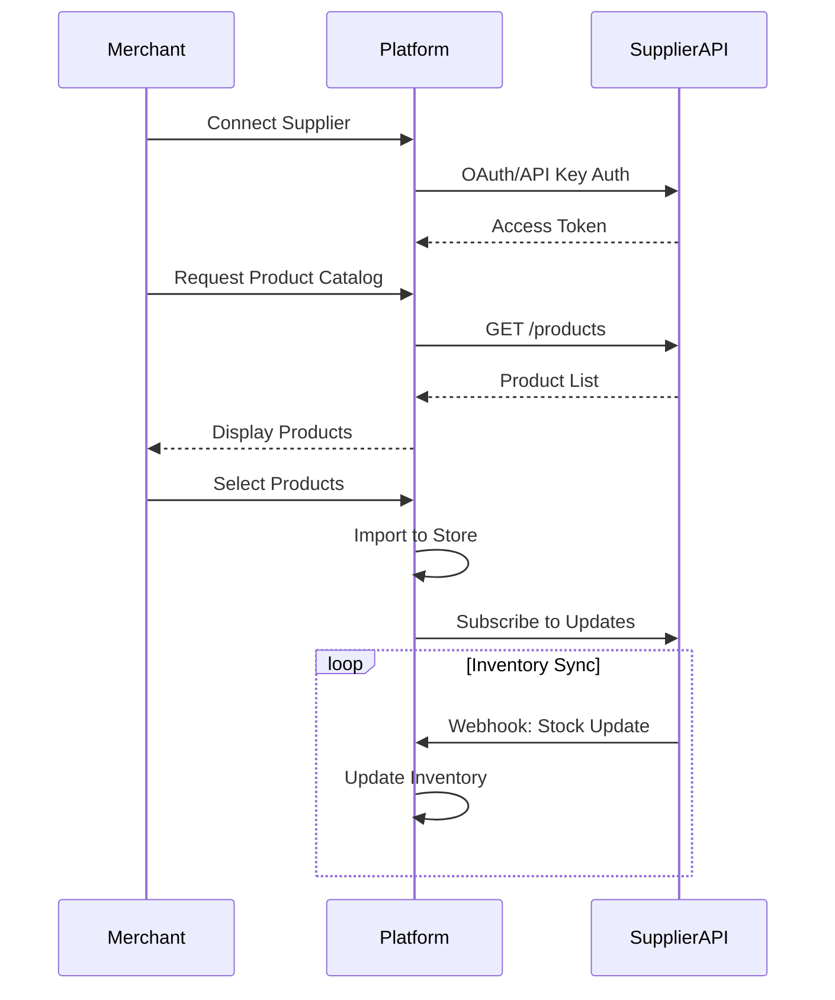

# Supplier Integration Module

## Overview
Manages supplier relationships, API integrations, product synchronization, and order forwarding for dropshipping operations.

## Integration Flow



## Features

### Supplier Management
- Supplier onboarding and verification
- API integration framework
- OAuth2 and API key authentication
- Supplier performance metrics
- Commission and pricing management
- Geographic restrictions and shipping zones

### Product Synchronization
- Real-time product catalog sync
- Automated inventory updates
- Price synchronization
- Product attribute mapping
- Image and media sync
- Bulk import/export capabilities

### Order Management
- Automatic order forwarding to suppliers
- Order status tracking
- Shipping and tracking integration
- Return and refund coordination
- Split orders across multiple suppliers

### Supported Integrations
- **Printify**: Print-on-demand products
- **Spocket**: Dropshipping marketplace
- **Oberlo**: Product sourcing
- **AliExpress**: Direct supplier integration
- **Generic REST API**: Custom supplier integrations

## API Endpoints

### Supplier Management
- `GET /suppliers` - List connected suppliers
- `POST /suppliers` - Connect new supplier
- `GET /suppliers/{id}` - Get supplier details
- `PUT /suppliers/{id}` - Update supplier settings
- `DELETE /suppliers/{id}` - Disconnect supplier

### Product Sync
- `POST /suppliers/{id}/sync` - Trigger product sync
- `GET /suppliers/{id}/products` - List supplier products
- `POST /suppliers/{id}/import` - Import selected products
- `PUT /suppliers/{id}/products/{product_id}` - Update product mapping

### Order Integration
- `POST /suppliers/{id}/orders` - Forward order to supplier
- `GET /suppliers/{id}/orders/{order_id}` - Get order status
- `PUT /suppliers/{id}/orders/{order_id}` - Update order

### Webhooks
- `POST /webhooks/suppliers/{id}/inventory` - Inventory updates
- `POST /webhooks/suppliers/{id}/orders` - Order status updates
- `POST /webhooks/suppliers/{id}/tracking` - Shipping updates

## Data Models

```rust
pub struct Supplier {
    pub id: Uuid,
    pub name: String,
    pub api_type: SupplierApiType,
    pub api_credentials: serde_json::Value,
    pub webhook_url: Option<String>,
    pub status: SupplierStatus,
    pub commission_rate: BigDecimal,
    pub created_at: DateTime<Utc>,
}

pub enum SupplierApiType {
    Printify,
    Spocket,
    Oberlo,
    AliExpress,
    RestApi,
}

pub enum SupplierStatus {
    Connected,
    Disconnected,
    Pending,
    Error,
}

pub struct SupplierProduct {
    pub id: Uuid,
    pub supplier_id: Uuid,
    pub external_id: String,
    pub name: String,
    pub price: BigDecimal,
    pub inventory_count: i32,
    pub sync_status: SyncStatus,
    pub last_synced: DateTime<Utc>,
}

pub struct SupplierOrder {
    pub id: Uuid,
    pub supplier_id: Uuid,
    pub platform_order_id: Uuid,
    pub external_order_id: Option<String>,
    pub status: SupplierOrderStatus,
    pub tracking_number: Option<String>,
    pub created_at: DateTime<Utc>,
}
```

## Implementation Priority
1. Supplier connection and authentication
2. Basic product synchronization
3. Order forwarding functionality
4. Inventory update webhooks
5. Tracking integration
6. Performance monitoring
7. Advanced supplier features