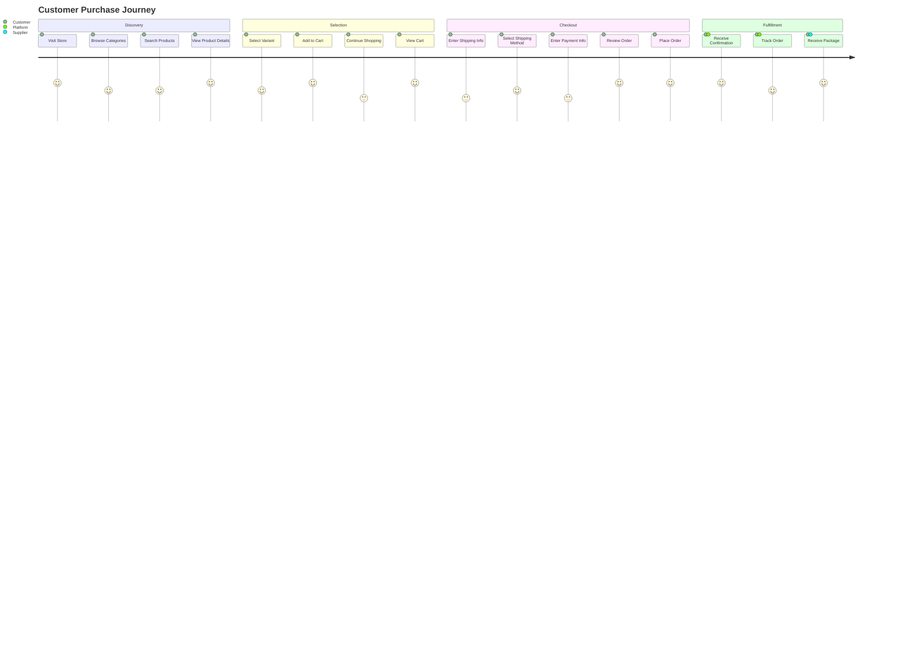
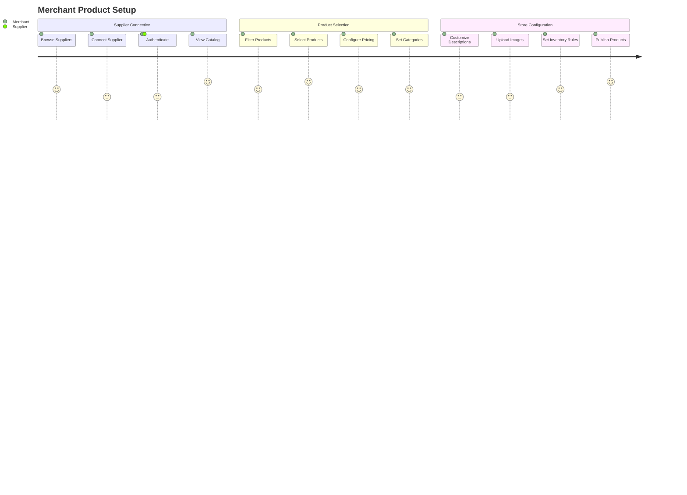

# User Flows Specification

## Overview
This section defines the key user journeys and workflows for all user types in the eCommerce platform.

## Flow Categories

1. **Customer Flows** - Shopping, purchasing, account management
2. **Merchant Flows** - Store setup, product management, order fulfillment
3. **Supplier Flows** - Integration, inventory management, order processing
4. **Admin Flows** - Platform management, monitoring, support

## Customer Purchase Flow

## Merchant Product Setup Flow

## Detailed Flow Descriptions

### Customer Flows

#### 1. Product Discovery
- **Entry Points**: Direct URL, search engines, marketing campaigns
- **Actions**: Browse categories, search, filter products
- **Pain Points**: Slow search, poor filtering, unclear product info
- **Success Metrics**: Time to find product, conversion rate

#### 2. Shopping Cart Management
- **Actions**: Add/remove items, update quantities, apply coupons
- **Persistence**: Guest cart, registered user cart
- **Recovery**: Cart abandonment emails, saved for later

#### 3. Checkout Process
- **Steps**: Shipping info → Payment info → Review → Confirmation
- **Options**: Guest checkout, account creation, express checkout
- **Validation**: Address validation, payment verification

### Merchant Flows

#### 1. Store Setup
- **Onboarding**: Account creation, store configuration, theme selection
- **Verification**: Identity verification, payment setup
- **Launch**: Store testing, domain setup, go-live

#### 2. Inventory Management
- **Supplier Integration**: Connect APIs, sync products
- **Product Curation**: Select products, set pricing, categorize
- **Ongoing**: Monitor stock, update prices, manage variants

#### 3. Order Fulfillment
- **Order Processing**: Receive orders, forward to suppliers
- **Tracking**: Monitor fulfillment, update customers
- **Support**: Handle returns, refunds, customer service

### Supplier Flows

#### 1. Platform Integration
- **Registration**: Supplier application, verification
- **API Setup**: Provide credentials, test integration
- **Catalog Upload**: Product data, images, pricing

#### 2. Order Processing
- **Order Receipt**: Receive forwarded orders
- **Fulfillment**: Process, pack, ship orders
- **Updates**: Provide tracking, handle issues

## Error Flows and Edge Cases

### Payment Failures
- Failed payment processing
- Insufficient funds
- Expired payment methods
- Retry mechanisms

### Inventory Issues
- Out of stock during checkout
- Supplier inventory discrepancies
- Backorder handling

### Technical Failures
- API timeouts
- Service unavailability
- Data synchronization issues

## Mobile-Specific Considerations

### Touch Interactions
- Optimized button sizes
- Swipe gestures for navigation
- Pull-to-refresh functionality

### Performance
- Faster loading on mobile networks
- Offline capabilities
- Progressive web app features

## Accessibility Features

### Navigation
- Keyboard navigation support
- Screen reader compatibility
- Voice command support

### Visual
- High contrast mode
- Font size adjustment
- Color blindness considerations

## Analytics and Tracking

### Customer Metrics
- Conversion funnel analysis
- Cart abandonment rates
- Product view patterns
- Search behavior

### Merchant Metrics
- Product performance
- Revenue analytics
- Customer acquisition costs
- Supplier performance

## Implementation Priority

1. **Core Customer Flow** (MVP)
   - Product browsing
   - Cart management
   - Basic checkout

2. **Merchant Essentials**
   - Store setup
   - Product management
   - Order tracking

3. **Advanced Features**
   - Supplier integration
   - Advanced analytics
   - Mobile optimization

4. **Enhanced Experience**
   - Personalization
   - Recommendations
   - Social features